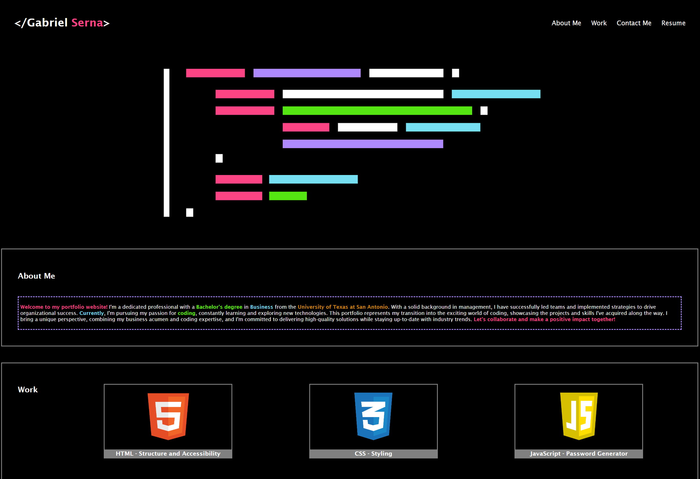

# Portfolio Website

Welcome to my portfolio website! This webpage showcases my journey as a coding student and features various sections to provide insights into my background, work, contact information, and resume.

## Table of Contents
- [About Me](#about-me)
- [Work](#work)
- [Contact Me](#contact-me)
- [Resume](#resume)
- [Usage](#usage)
- [Screenshot](#screenshot)

## About Me
In the **About Me** section, you'll find a short bio that highlights my passion for coding and my educational background. I hold a Bachelor's degree in Business from the University of Texas at San Antonio, and I'm currently pursuing my coding journey to further enhance my skills and knowledge in this exciting field. Combining my business acumen with coding expertise, I'm dedicated to delivering high-quality solutions and staying up-to-date with industry trends.

## Work
The **Work** section showcases my most recent applications and projects. You'll find details and links to these projects, which demonstrate my practical implementation of coding concepts and problem-solving skills. Each project represents a unique challenge and showcases my growth as a coding student.

## Contact Me
The **Contact Me** section provides multiple ways to get in touch with me. You'll find my email address and phone numbers for both US and Mexico, allowing you to reach out easily. Feel free to contact me if you have any inquiries, collaboration opportunities, or if you simply want to connect!

## Resume
The **Resume** section will soon feature my actual resume, providing a comprehensive overview of my professional experience, education, skills, and achievements. Stay tuned for the updated version of my resume, which will be available for download.

## Usage
To view my portfolio website, please visit [desired_website_link](https://www.example.com).

## Screenshot

Thank you for visiting my portfolio website! I hope you enjoy exploring my projects and learning more about my coding journey. If you have any feedback or suggestions, please feel free to reach out.

